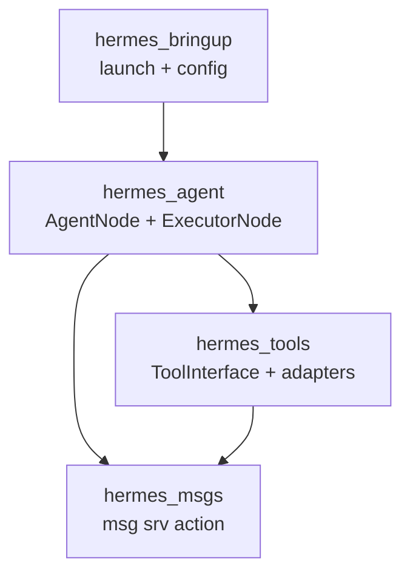
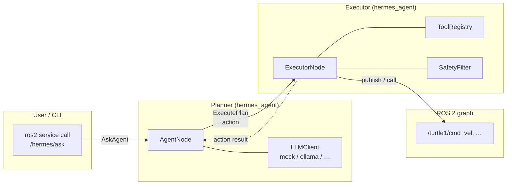
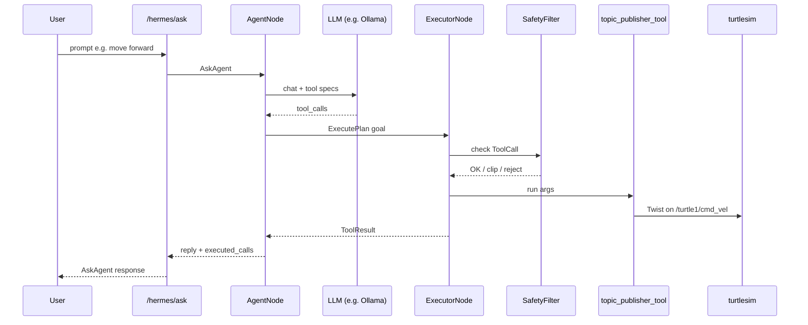

# hermes-agent-ros

ROS2-native agent framework. LLM agents run as ROS2 nodes and manipulate
topics, services, and actions as "tools".

Design docs live in [`docs/`](./docs). Deep dive: [`docs/architecture.md`](./docs/architecture.md).

## Architecture diagrams

The planner and executor are split; only **typed `ToolCall`s** cross into the
robot side. GitHub renders [Mermaid](https://github.blog/news-insights/product-news/github-now-supports-mermaid-diagrams/)
in the Markdown view; plain viewers may show the code blocks as text.

**Package dependency (overview):**



**Runtime (nodes and data flow, conceptual):**



**One-shot question → `cmd_vel`** (turtlesim demo sketch):



## Web visualization (browser alternative to RViz)

There is no actively maintained “RViz2 in the browser as-is” story; Webviz /
Foxglove-style tools are the usual path. For live topics in a browser, run
**`ros-jazzy-foxglove-bridge`** (WebSocket) and connect with **Foxglove Studio**
([studio.foxglove.dev](https://studio.foxglove.dev/) /
[app.foxglove.dev](https://app.foxglove.dev/)) or open-source **Lichtblick**
([web app](https://lichtblick-suite.github.io/lichtblick/),
[ROS 2 docs](https://lichtblick-suite.github.io/docs/docs/connecting-to-data/frameworks/ros2)).
Both use the **Foxglove WebSocket** protocol to the same `ws://…` endpoint.

- Show turtlesim + hermes traffic (e.g. `/turtle1/pose`, `/turtle1/cmd_vel`) in **Raw Messages** / **Plot** panels.
- **Playwright screen recordings**, saved layouts, topic tables: [`examples/foxglove_turtlesim/README.md`](./examples/foxglove_turtlesim/README.md).

## Packages

| Package | Build type | Purpose |
|---|---|---|
| `hermes_msgs` | `ament_cmake` | ROS2 interfaces (msg/srv/action) |
| `hermes_agent` | `ament_python` | AgentNode (planner) + ExecutorNode + LLM clients |
| `hermes_tools` | `ament_python` | ToolInterface base + generic ROS2 tools |
| `hermes_bringup` | `ament_python` | launch files and runtime config |

## Target

- ROS2 Jazzy (primary)
- Python 3.12+
- `rclpy`, `ament_python`
- Local LLM runtime (Ollama recommended — see `docs/plan.md` §4).
  Cloud LLM backends are deprioritised (ADR-004).

## Quickstart

```bash
colcon build --symlink-install
source install/setup.bash
ros2 launch hermes_bringup turtlebot_demo.launch.py llm:=mock
ros2 service call /hermes/ask hermes_msgs/srv/AskAgent "{prompt: 'move forward'}"
```

With a local [Ollama](https://ollama.com/) daemon and a **tool-capable**
instruct model, run the same demo against a real LLM. On modest GPUs,
`qwen2.5:3b-instruct` has been used successfully for native tool calls;
`qwen2.5:7b-instruct` is an alternative if you have headroom (cold load
and tool latency can be high).

```bash
export ROS_DOMAIN_ID=224   # use any free id <= 232; avoids DDS port errors
# optional: export ROS_LOCALHOST_ONLY=1
export HERMES_OLLAMA_MODEL=qwen2.5:3b-instruct
ros2 launch hermes_bringup turtlebot_demo.launch.py llm:=ollama
# Slow models: ollama_timeout_sec:=240.0
# turtlebot_demo defaults default_cmd_vel_topic:=/turtle1/cmd_vel so small
# models that omit `topic` still publish to the demo topic.
ros2 service call /hermes/ask hermes_msgs/srv/AskAgent "{prompt: 'move forward'}"
```

Measured Ollama + turtlesim behaviour (pose, timings, caveats) lives in
[`docs/experiments.md`](./docs/experiments.md).

See `examples/turtlebot_demo/README.md` for the demo.

For picking up this codebase (e.g. in Cursor), start with
[`docs/plan.md`](./docs/plan.md) — handoff covering architecture,
conventions, and optional follow-ups (e.g. `OpenAICompatClient`, prompt
tuning for all three scenarios).

## Tests

```bash
source /opt/ros/jazzy/setup.bash
source install/setup.bash
colcon test --event-handlers console_direct+ --return-code-on-test-failure
colcon test-result --verbose
```

Current suite: 63 tests (31 in hermes_tools, 32 in hermes_agent) covering
SafetyFilter, MockClient, ShortTermMemory/ToolLog, all four tool adapters
against real rclpy, and three turtlebot_demo scenarios end-to-end.
